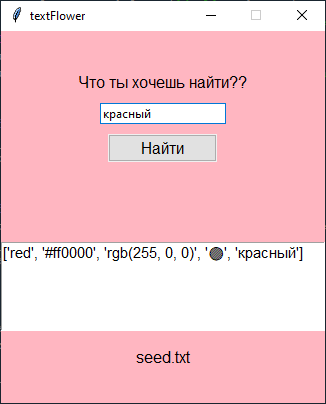

# TextFlower

TextFlower - программа, которая может выбрать буквенное название цвета в ответ на запрос в виде слова на русском или английском 
языке, шестнадцатеричного или RGB-кода, либо эмодзи. Оно пока строго ограничено тем небольшим словарем слов, который лежит при нем.

## Примеры запросов:

```python
- red
- #ff0000
- rgb(255, 0, 0) - spaces must also be between the numbers, otherwise an error!
- 🔴
- красный
```

## Пример ответа:

```python
['red', '#ff0000', 'rgb(255, 0, 0)', '🔴', 'красный']
```

---



*Рисунок 1. Скриншот программы*